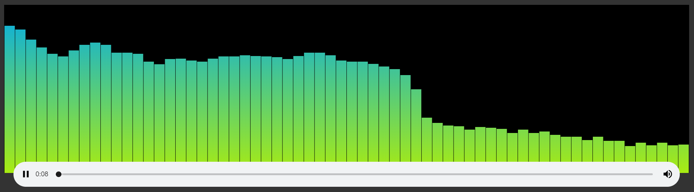

# HTML Audio Visualizer
Visualizer for music in html/js

https://deniszholob.github.io/html-audio-visualizer/

## References

* https://codepen.io/nfj525/pen/rVBaab
* https://webaudio.github.io/web-audio-api/
* https://developer.mozilla.org/en-US/docs/Web/API/Canvas_API/Tutorial/Basic_animations
* https://medium.com/@huiwang339/html-canvas-animation-with-javascript-1956426287d3
* https://medium.com/wdstack/fixing-html5-2d-canvas-blur-8ebe27db07da
* https://www.html5rocks.com/en/tutorials/webaudio/intro/
* https://stackoverflow.com/questions/31308679/mediaelementaudiosource-outputs-zeros-due-to-cors-access-restrictions-local-mp3